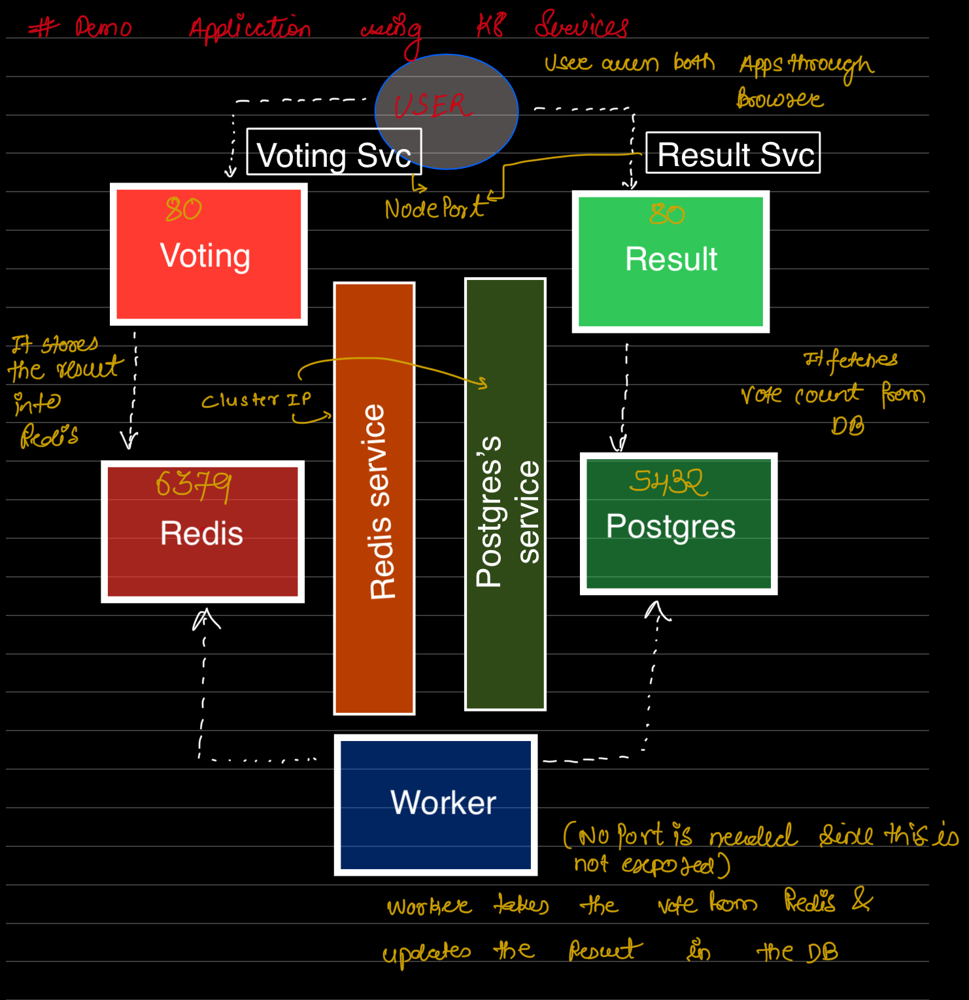

# Deployment of 3 Tier Architecture webservice using Minicube 

This is simple k8s project to deploy 5 Pods for microservice architecture. Pods have interconnectivity using Services.
They have been externally exposed (localhost) to test out working of the application. 

## Overview of the application 

- Application has 3 tiers in the Webapp 
  - Frontend (Voting, Result) applications 
  - Backend (Worker) app
  - Database (Redis, Postgress) applications 
- NodePort Service is used to expose frontend applications to users
- ClusterIP Service is used to internally communicate Database layers with frontend and backend
- Pods are deployed using deployments to handle the scaling
- NodePort Services are used to internally the distribute the traffic between voting-pods 

### How to run 

- Prerequiste
  - Installed docker driver( or any virtual machine driver )
  - Installed kubectl 
  - Installed minikube (2GB Ram minimum)
- How to spin up the application 
  - Run the minikube `minikube start` (wait for the minikube to start)
  - Deploy all deployments and Services from the code repo using following order 
    * Deploy voting app deployment and service
    * Deploy result app deployment and service 
    * Deploy redis app deployment and service 
    * Deploy postgress app deployment and service 
    * Deployment worker app deployment 
  - Use the generic command to deploy all components `kubectl create -f <filename> --record` (  `--record` ensures that K8s can keep track of the history/version during upgrades/rollouts/rollbacks)
- How to test the application
  - Run the frontend voting app using `minikube service voting-service`
  - Open another terminal and run `minikube service result-service`
  - You can case vote on Voting App UI and it should get reflected on the Result App UI

### Architecture for the Project 

### References 

Application code is taken from the www.kodekloud.com test exercises. All docker images used are developed and maintained by Kodekloud 

